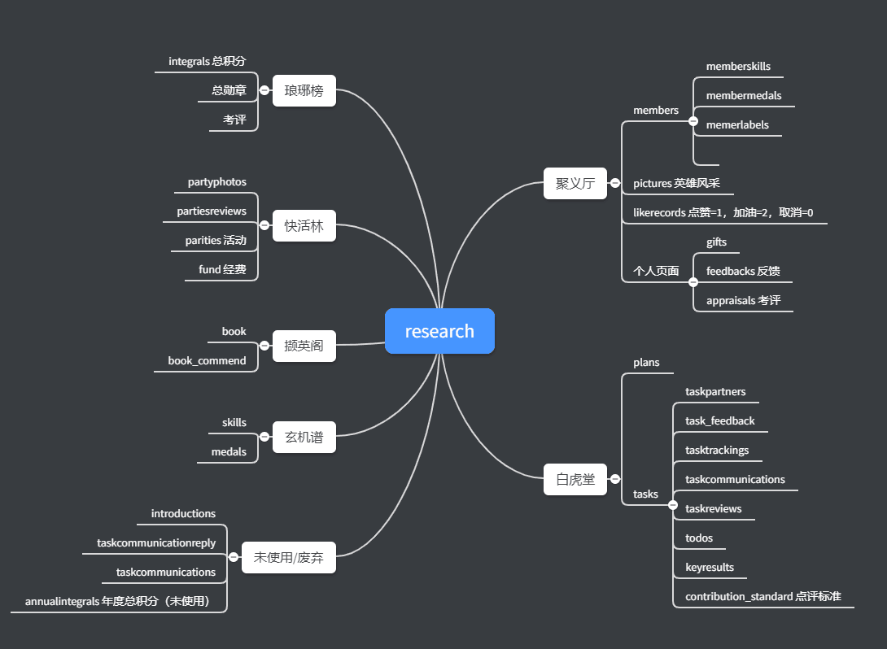

##	总纲

\\192.168.1.101\Shared\Documents\ResearchHome\4.0



##	Task

### 待分析

- [ ] 书评操作分析
- [ ] 默认头像
- [x] 琅琊榜排名分页限制10


###	重构注意事项

- [ ] 字段过滤
- [ ] SSO注册中心 可行性分析
- [ ] 模型对象重构

### 已完成

- [x] 

- [ ] a) 长图添加到英雄风采里面，会放倒显示。

- [x] b) 删除积分记录后，总积分没有减少

  ​	doc的[synchrodata.sql]( [synchrodata.sql](T-SQL\synchrodata.sql) )同步旧数据丢失

  ```cs
  AppraisalsController	//个人考核	
  ```


- [x]  c) 玄机谱中勋章发放个数统计不对

 - [x] d) 快速点击保存时，会保存多条记录

- [x] e) 总勋章榜和考评榜应该像总积分榜那样，不包含离职英雄的排名

- [ ] 

  

 - [x] f) 创建新任务时，无法选择截至日期

- [x]  g) 任务的“完成于”时间只有将任务状态改成“完成”时修改一次，后面修改状态时不再修改该字段，目前关闭任务时也会修改这个时间值。

- [x]  h) 修复点击详情页面中的头像显示小图片的问题


##	Account

测试账号用户名 

member1,member2,

admintest1,admintest2， 

sun用1 wang用2 ，

密码都是123456


##	UE体验待强化

- [ ] Todo状态还需修改的【默认执行中好一些】
- [ ] 系统高热的K-V与缓存的集中配置
- [ ] 幂等请求后，却仍然发起接口请求【读写】

## 连接字符串

```json

    "DefaultConnection": "server=192.168.1.102;Database=research_home;Uid=fooww;Pwd=Fooww_08@2018;SslMode=none;Allow User Variables=True"
```


```json
"ConnectionStrings": {
   "DefaultConnection": "server=127.0.0.1;Database=research_home;Uid=root;Pwd=root;SslMode=none;Allow User Variables=True",
  "DefaultConnection2": "server=192.168.1.118;Database=research_home;Uid=fooww;Pwd=Fooww_08@2018;SslMode=none;Allow User Variables=True"
}
```

