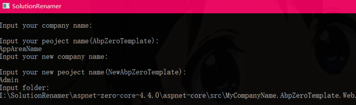
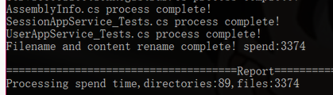

1. 首先解压这个包

2. .运行 SolutionRenamer

   依次输入当前项目的：公司名、项目名、新公司名、新项目名和项目根目录路径

   

根据提示输入

- 旧项目公司名
- 旧项目方案名
- 新项目公司名
- 新项目方案名
- 项目路径输入`MVC项目的根目录

等待程序执行完成，看到如下提示便代表执行成功

> 公司名及新公司名不用输入，直接回车。
>
> 项目名写输入`需要改变的Area名称`，新项目名输入`新的Area名称`，
>
>  
>
> 如图所示，我的项目路径为：
>
> `I:\SolutionRenamer\aspnet-zero-core-4.4.0\aspnet-core\src\MyCompanyName.AbpZeroTemplate.Web`