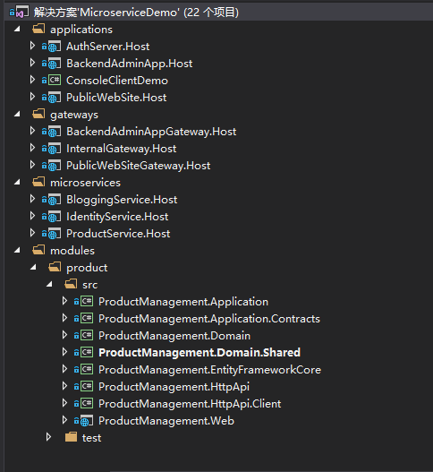

# Micro service architecture


##	Project structures

### 1.Applications	应用

基础设施

###	2.Gateways	网关

### 3.MicroServices	服务

项目业务 应用服务

###	4.Modules 模块组成



# Deployment	项目部署

### EFCore切换mysql数据库

```powershell
在EntityFrameworkCore项目中添加 
Install-Package Pomelo.EntityFrameworkCore.MySql	和 
Install-Package Pomelo.EntityFrameworkCore.MySql.Design		两个包，以便支持MySql

Install-Package Microsoft.EntityFrameworkCore.Tools
```

### 	上下文切换数据库

ResearchDbContextConfigurer

```
    public static class SimpleCmsWithAbpDbContextConfigurer
    {
        public static void Configure(DbContextOptionsBuilder<SimpleCmsWithAbpDbContext> builder, string connectionString)
        {
            //builder.UseSqlServer(connectionString);
            builder.UseMySql(connectionString);           
        }

        public static void Configure(DbContextOptionsBuilder<SimpleCmsWithAbpDbContext> builder, DbConnection connection)
        {
            //builder.UseSqlServer(connection);
            builder.UseMySql(connection);
        }
    }

```

### 删除原有其他数据库的【Migrations】

###	配置链接字符串

```json
  "ConnectionStrings": {
    "Default": "server=127.0.0.1;port=33066;Database=DgSquare2019;Uid=root;Pwd=wsx1001;SslMode=none;Allow User Variables=True",
    "Default2": "Server=localhost; Database=ResearchDb; Trusted_Connection=True;"
  },
```

###	迁移 更新数据库


```
Add-Migration Init
Update-Database
```


###  ABP集成的IdentityServer4

```
 Abp.ZeroCore.IdentityServer4
 Install-Package  Abp.ZeroCore.IdentityServer4
 
```


# ABP简介与文档

## 介绍Introduction

This is a template to create **ASP.NET Core MVC / Angular** based startup projects for [ASP.NET Boilerplate](https://aspnetboilerplate.com/Pages/Documents). It has 2 different versions:

1. [ASP.NET Core MVC & jQuery](https://aspnetboilerplate.com/Pages/Documents/Zero/Startup-Template-Core) (server rendered multi-page application).
2. [ASP.NET Core & Angular](https://aspnetboilerplate.com/Pages/Documents/Zero/Startup-Template-Angular) (single page application).

User Interface is based on [BSB Admin theme](https://github.com/gurayyarar/AdminBSBMaterialDesign).

## Download模板下载

Create & download your project from https://aspnetboilerplate.com/Templates

##	 Documentation文档

* [ASP.NET Core MVC & jQuery version.](https://aspnetboilerplate.com/Pages/Documents/Zero/Startup-Template-Core)
* [ASP.NET Core & Angular  version.](https://aspnetboilerplate.com/Pages/Documents/Zero/Startup-Template-Angular)

## License 开源协议

[MIT](LICENSE).